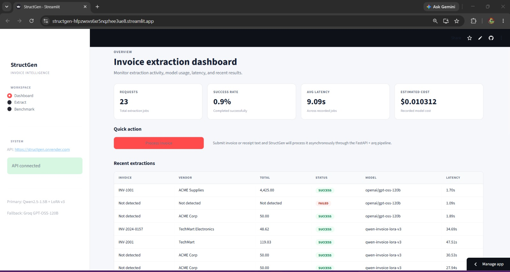
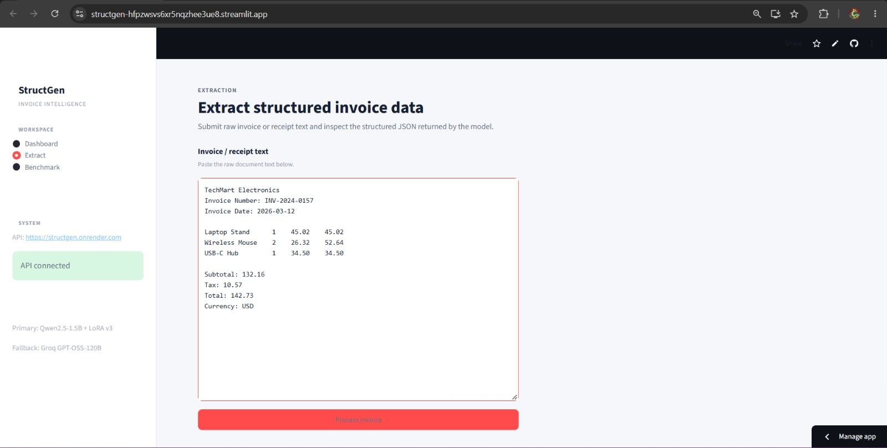

# StructGen

A benchmarking system that pits a large prompted LLM (Groq `gpt-oss-120b`) against a LoRA fine-tuned small language model (`Qwen2.5-1.5B-Instruct`) for schema-validated, structured JSON extraction from unstructured invoice and receipt text.

## Demo


*The Streamlit dashboard where a user submits invoice/receipt text for extraction.*


*Raw receipt text extracted into schema-validated structured JSON.*


*Field accuracy comparison between the Groq baseline and the LoRA fine-tuned model.*


**Live app:** https://structgen.onrender.com
**Repo:** [Navyachhoker/StructGen](https://github.com/Navyachhoker/StructGen)

---

## Overview

StructGen answers a practical question: for structured extraction tasks, when does a small fine-tuned model actually earn its keep against a large general-purpose LLM prompted for the same job? Rather than assuming an answer, this project builds both paths end-to-end, runs them through the same async pipeline, and measures the trade-off on real, unseen data.

## Problem

Invoices and receipts carry semi-structured information that varies significantly by vendor, layout, and region. Rule-based template extraction breaks the moment a layout changes. General-purpose LLMs handle this variability well but are expensive to run at scale and slow relative to smaller models. Fine-tuned small models are cheap and fast but require labeled data and can overfit to the distribution they were trained on.

StructGen investigates whether a prompted large LLM or a LoRA fine-tuned small model produces more reliable structured extraction under a fixed Pydantic schema and realistic infrastructure constraints — and quantifies exactly what is gained and lost in the trade.

## Objectives

- Extract structured invoice/receipt data from raw text into a fixed schema.
- Enforce schema validity with Pydantic v2 rather than trusting raw model output.
- Compare a prompted LLM baseline against a LoRA fine-tuned small model on identical data.
- Measure extraction quality on both synthetic and real, hand-labeled holdout data.
- Serve extraction through an asynchronous, production-style API with background job processing.
- Document infrastructure trade-offs and limitations honestly rather than presenting a single flattering number.

## Key Features

- Schema-constrained invoice/receipt extraction with Pydantic v2 validation
- Prompted LLM baseline (Groq `gpt-oss-120b`)
- LoRA fine-tuned small-model pipeline (`Qwen2.5-1.5B-Instruct`)
- Schema-validation-only fallback routing (deterministic, reproducible — not confidence-score-based)
- Async FastAPI backend with background job processing via `arq`
- In-process worker architecture (avoids a paid Render background-worker tier)
- PostgreSQL persistence via Supabase (async, `asyncpg`)
- Streamlit dashboard for interactive extraction and result inspection
- Ground-truth-by-construction synthetic dataset (233 pairs), cross-model generated to avoid same-family contamination
- Real-world evaluation against a hand-labeled SROIE receipt holdout

## Architecture

```
                    ┌─────────────────┐
                    │  Streamlit UI   │
                    └────────┬────────┘
                             │
                             ▼
                    ┌─────────────────┐
                    │    FastAPI      │
                    │   /extract      │
                    └────────┬────────┘
                             │
                         enqueue
                             │
                             ▼
                    ┌─────────────────┐
                    │  arq Worker     │
                    │ (in-process)    │
                    └────────┬────────┘
                             │
                             ▼
                    ┌─────────────────┐
                    │  Model Router   │
                    └──────┬───┬──────┘
                           │   │
                 ┌─────────┘   └─────────┐
                 ▼                       ▼
          ┌─────────────┐         ┌─────────────┐
          │  Groq LLM   │         │ LoRA Fine-  │
          │  Baseline   │         │ tuned Qwen  │
          └──────┬──────┘         └──────┬──────┘
                 │                       │
                 └───────────┬───────────┘
                              ▼
                    ┌─────────────────┐
                    │ Pydantic Schema │
                    │   Validation    │
                    └────────┬────────┘
                             │
                    fails ───┼─── passes
                    │                 │
                    ▼                 ▼
             fallback to        persist result
             baseline model            │
                                        ▼
                              ┌─────────────────┐
                              │   PostgreSQL     │
                              │   (Supabase)     │
                              └─────────────────┘
```

The system is deliberately built as a production-shaped pipeline rather than a notebook: requests are queued rather than handled synchronously, model output is treated as untrusted and validated before persistence, and failures degrade gracefully to the more reliable baseline model instead of surfacing invalid JSON to the client.

## How It Works

1. The user submits invoice/receipt text through the Streamlit UI or the API directly.
2. FastAPI creates an extraction job and enqueues it via `arq`.
3. The in-process `arq` worker picks up the job (no separate paid worker process).
4. The model router dispatches the job to the configured model (Groq baseline or LoRA Qwen).
5. The model generates structured output, which is validated against the Pydantic invoice schema.
6. On schema validation failure, the job falls back to the baseline model — fallback triggers purely on validation failure, not confidence scores, for reproducibility. Reported fallback latency is the sum of both model calls, not just the successful one.
7. The validated extraction result and run metadata are persisted to PostgreSQL.
8. The client polls the job endpoint for completion.
9. The dashboard displays the extracted fields alongside system/benchmark statistics.

## Model Approaches

| Approach | Description |
|---|---|
| Prompted LLM (baseline) | Groq `openai/gpt-oss-120b`, prompted to produce structured invoice JSON |
| Fine-tuned model | `Qwen2.5-1.5B-Instruct`, adapted via LoRA specifically for invoice/receipt extraction |

The comparison is scoped to field accuracy and line-item precision on real, unseen data — not a general capability claim about either model.

## Dataset

**Synthetic training/test data** — 233 total pairs (205 train / 28 test):
- Generated using Gemini Flash-Lite for rendering, with Groq used only for roundtrip validation.
- Gemini and Groq are deliberately different model families, avoiding the scenario where a model generates and validates its own training data.
- Labels are ground-truth-by-construction: JSON is generated programmatically first, then rendered into invoice text — not extracted from model output — which avoids label noise from model errors.

**Real evaluation holdout** — 13 hand-labeled entries from the SROIE dataset (Malaysian receipts, MYR):
- Used exclusively for evaluation, never for training.
- Documented as a small sample size; results from it are directionally informative, not statistically definitive.

## Fine-Tuning

LoRA fine-tuning of `Qwen2.5-1.5B-Instruct` was run on Colab.

<!-- Fill in your actual run configuration:
| Parameter | Value |
|---|---|
| Base model | Qwen2.5-1.5B-Instruct |
| Training examples | 205 |
| Validation/test examples | 28 |
| LoRA rank | ... |
| LoRA alpha | ... |
| Learning rate | ... |
| Epochs | ... |
| Batch size | ... |
| Max sequence length | ... |
-->

Notable bugs found and fixed during the fine-tuning pipeline build:
- A field-name mismatch between the expected `instruction`/`output` format and the actual `prompt`/`completion` format used by the training script.
- Incorrect prompt-token label masking (prompt tokens were being included in the loss instead of masked out).
- A pad-token configuration bug affecting training stability.

## Evaluation Methodology

Models are evaluated on both the synthetic test split and the real SROIE holdout, using:
- Field-level accuracy
- Line-item extraction precision
- Schema validity (via Pydantic)

Evaluation is performed on held-out examples not used in training, with the real holdout providing an out-of-distribution check on the synthetic-trained model.

## Results

Measured on the real SROIE holdout (n = 13):

| Metric | Groq Baseline | LoRA Qwen | Base Qwen (no fine-tune) |
|---|---:|---:|---:|
| Field accuracy | **79.12%** | 54.95% | 46.15% |
| Line-item precision | ~93% | ~71% | — |

**Key finding:** LoRA fine-tuning improved field accuracy over the base small model by +8.8 points, but this came at the cost of line-item precision, which dropped from ~93% to ~71% due to increased line-item hallucination. The large prompted baseline remains meaningfully stronger on real, out-of-distribution data — a result that is reported directly rather than reframed to favor the fine-tuned model.

Full results and methodology are documented in [`BENCHMARK.md`](BENCHMARK.md).

## Failure Analysis

The dominant real-world failure mode was **line-item hallucination** in the fine-tuned model: it fabricated or duplicated line items not present in the source text, which is the primary driver of its precision drop despite higher field accuracy. Documented contributing factors:

- **Hardware asymmetry** — Groq's LPU inference vs. CPU inference for the small model means latency comparisons aren't apples-to-apples.
- **Synthetic-to-real distribution shift** — the model was trained on Gemini-rendered synthetic invoices and evaluated on real SROIE receipts, a genuine domain gap.
- **Small holdout size** — n = 13 limits how confidently these numbers generalize.
- **Regional skew** — SROIE is Malaysian-receipt-specific (MYR), which may not represent other invoice formats/currencies.
- **OCR is explicitly out of scope** — the pipeline assumes clean input text, not scanned/noisy OCR output.

These findings shaped the schema-validation-only fallback design: rather than trying to detect hallucination via confidence heuristics, any schema-invalid output is deterministically routed to the more reliable baseline model.

## Tech Stack

**Backend:** Python, FastAPI, Pydantic v2, `arq`, `asyncpg`
**AI/ML:** Groq (`openai/gpt-oss-120b`), Gemini Flash-Lite, LoRA fine-tuning on `Qwen2.5-1.5B-Instruct`, Ollama (local inference), Colab (fine-tuning GPU)
**Database:** PostgreSQL via Supabase (Session Pooler, `ap-southeast-1`)
**Queue/Cache:** Upstash Redis (free tier, Mumbai region)
**Frontend:** Streamlit
**Deployment:** Render (API + in-process worker), Streamlit Community Cloud (dashboard)

## Project Structure

```
StructGen/
├── core/
│   └── clients/
│       └── gemini_client.py
├── scripts/
│   ├── generate_synthetic_data.py
│   └── finetune_lora.py
├── data/
│   └── real_holdout/
│       └── real_test.jsonl
├── BENCHMARK.md
└── README.md
```

<!-- Expand this with your full tree (api/, db/, schemas/, worker.py, streamlit_app/, tests/, pyproject.toml, etc.) once finalized. -->

## Getting Started

### 1. Clone the repository
```bash
git clone https://github.com/Navyachhoker/StructGen.git
cd StructGen
```

### 2. Create and activate a virtual environment
```bash
python -m venv .venv
# Windows (PowerShell)
.venv\Scripts\Activate.ps1
```

### 3. Install dependencies
```bash
pip install -e ".[dev]"
```

### 4. Configure environment variables
Create a `.env` file (never commit real secrets):
```
GROQ_API_KEY=...
GEMINI_API_KEY=...
DATABASE_URL=...
REDIS_URL=...
```

## Running the Application

```bash
# API (worker runs in-process, no separate process needed)
uvicorn <app_module>:app --reload

# Dashboard
streamlit run streamlit_app/app.py
```

## Testing

```bash
pytest tests/ -v
```

## Engineering Decisions

**Why an in-process `arq` worker instead of a separate worker service?**
Running the worker inside FastAPI's lifespan avoids a ~$7/month Render background-worker cost, at the deliberate trade-off of coupling worker lifecycle to the web process — a reasonable trade for a portfolio-scale deployment, documented rather than hidden.

**Why schema-validation-only fallback instead of confidence-based routing?**
Confidence scores are noisy and inconsistently calibrated across model families. Triggering fallback purely on Pydantic validation failure is deterministic and fully reproducible.

**Why Gemini for synthetic data rendering and Groq for validation?**
Using two different model families for generation and validation avoids the same-model-family contamination problem, where a model could implicitly "know" how to satisfy its own generation patterns.

**Why ground-truth-by-construction labels?**
Generating the JSON label first and rendering it into invoice text — rather than extracting labels from model output — removes a source of label noise that would otherwise compound during fine-tuning.

**Why LoRA instead of full fine-tuning?**
Full fine-tuning updates all model parameters and requires substantially more compute/memory. LoRA adapts the model for the extraction task while training a much smaller parameter set, which fits the free-tier/Colab compute budget this project was built under.

## Limitations

- Real-world evaluation is based on a small holdout (n = 13); results are directional, not statistically robust.
- The fine-tuned model shows measurable line-item hallucination on out-of-distribution real data.
- SROIE is regionally skewed (Malaysian receipts, MYR) and may not represent other invoice formats or currencies.
- OCR/scanned-document handling is explicitly out of scope — the pipeline assumes clean input text.
- Free-tier infrastructure (Upstash Redis, Render cold starts) introduces latency and reliability constraints not present in a production deployment.
- Latency comparisons between Groq (LPU) and the small model (CPU inference) are affected by hardware asymmetry, not model quality alone.

## Future Work

- Expand the real-world holdout beyond 13 examples for more statistically confident results.
- Add OCR/image-based invoice ingestion.
- Investigate line-item hallucination mitigation (e.g., structured decoding, stricter line-item schemas).
- Broaden real-data evaluation beyond SROIE to other regions/currencies.
- Add automated benchmark regression reporting.

## Lessons Learned

- LLM output cannot be treated as inherently reliable structured data — schema validation is a necessary boundary, not an optional nicety.
- A single headline accuracy number can hide an important trade-off (here, field accuracy vs. line-item precision); both matter and should be reported together.
- Free-tier infrastructure constraints (idle timeouts, cold starts) are worth documenting explicitly rather than fixing over, since they materially affect real-world behavior.
- Same-model-family contamination is a real risk in synthetic data generation and is straightforward to avoid by using different model families for generation and validation.
- Honest, caveat-forward benchmarking is more credible — and more useful in an interview — than an inflated headline result.

## Security

- API keys and credentials are loaded from environment variables only.
- `.env` files are excluded via `.gitignore` and never committed.
- No secrets are hardcoded in source or documentation.

## License

<!-- e.g. This project is licensed under the MIT License. -->

## Author

**Navya Chhoker**
B.Tech CSE (Data Science), Gautam Buddha University 